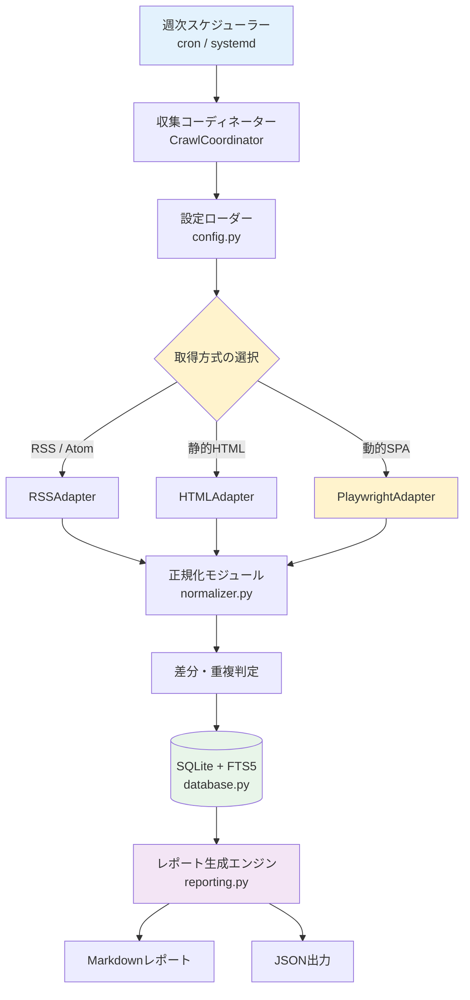
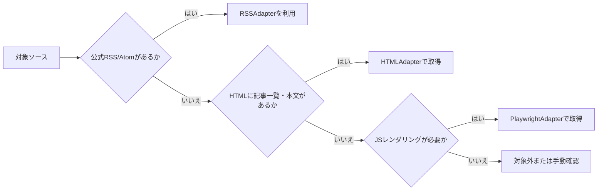
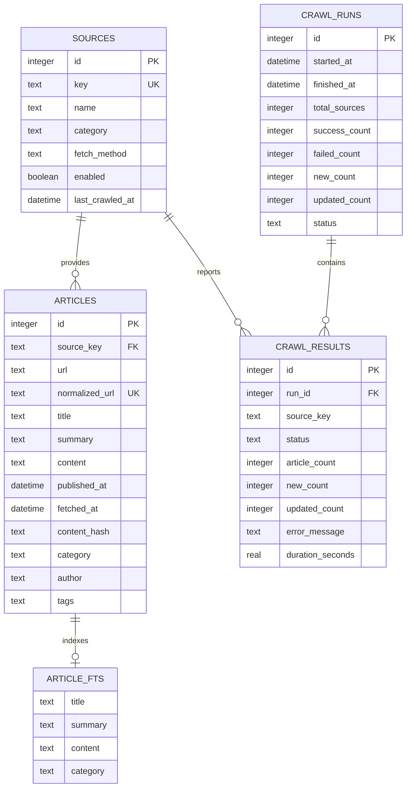

週1回程度のペースで効率的に最新トレンドやビジネス動向、技術動向をキャッチアップできるよう、国内外の主要なAI情報ソースから記事情報を収集し、SQLiteに保存してMarkdownレポートを生成するシステムの仕様書および実装ウォークスルーです。

---

## 1. プロジェクト概要と設計方針

本プロジェクト（`ai_scraper`）は、急速に進化するAI技術および市場動向の情報を効率的かつ持続的に収集することを目的としています。

### 設計の基本方針

1. **ハイブリッド取得アプローチ**:
   - 負荷が低く安定している **RSS / Atom フィード** を最優先。
   - フィードがない場合は **静的 HTML スクレイピング**（Scrapy / BeautifulSoup）。
   - JavaScript 実行が不可欠な SPA のみ **Playwright**（ヘッドレス Chromium）を使用。
2. **差分クロールと重複排除**:
   - URL から追跡パラメーター（UTM 等）を除去して正規化。
   - タイトルおよび本文の SHA-256 ハッシュ値を算出し、コンテンツに変更があった場合のみ更新。
3. **SQLite + FTS5 全文検索**:
   - 外部コンテナを不要とし、WSL2 ネイティブ環境で最高速に動作する SQLite（WAL モード）を採用。
   - FTS5（unicode61 トークナイザー）による高速な日本語・英語のキーワード検索を提供。
4. **ソース単位のエラー分離**:
   - 一部のサイトがアクセス制限や構造変更で失敗しても、全体の処理を中断させずに他ソースの収集を継続。
5. **GitLab 公開前提のクリーンな設計**:
   - 秘密情報やデータベース本体をリポジトリから除外し、CI（GitLab CI）およびテスト環境を整備。

---

## 2. システム仕様 (SPEC)

### 2.1 システム全体アーキテクチャ

システムは、スケジューラー、収集コーディネーター、取得アダプター群、SQLite リポジトリ、およびレポート生成器で構成されます。



### 2.2 取得方式の判断フロー

各情報ソースの構造に応じて、以下のフローチャートに基づいて最適な取得アダプターを決定します。



### 2.3 データベーススキーマ設計



---

## 3. 実装ウォークスルー (Implementation Walkthrough)

### 3.1 ディレクトリ構成と役割

```text
ai_scraper/
├── pyproject.toml              # uv パッケージ設定・CLI 定義
├── uv.lock                     # 依存バージョン完全固定ロック
├── package.json                # npm スクリプト・Markdown Lint 設定
├── .markdownlint.json          # Markdown lint ルール設定
├── .textlintrc.json            # 日本語 textlint ルール設定
├── .textlintignore             # textlint 除外設定
├── .gitlab-ci.yml              # GitLab CI パイプライン設定
├── LICENSE                     # MIT License
├── README.md                   # ユーザー向けドキュメント
├── AGENTS.md                   # エージェント用リファレンス
├── Idea_memo.md                # 本開発仕様書・ウォークスルー
├── config/
│   ├── crawler.yaml            # レート制限・タイムアウト等のクローラー共通設定
│   ├── sources.example.yaml    # ソース設定テンプレート
│   └── sources.yaml            # 実運用ソース設定
├── src/
│   └── ai_scraper/
│       ├── __init__.py         # パッケージ初期化
│       ├── cli.py              # Click + Rich による CLI インターフェース
│       ├── config.py           # YAML 設定ローダーおよび Pydantic バリデーター
│       ├── models.py           # Pydantic v2 データモデル群
│       ├── database.py         # SQLite + FTS5 リポジトリ層
│       ├── normalizer.py       # URL 正規化・テキスト整形・ハッシュ計算
│       ├── coordinator.py      # クロール実行コーディネーター
│       ├── reporting.py        # Markdown レポート生成エンジン
│       ├── utils.py            # システム CA 証明書の自動解決ユーティリティ
│       └── adapters/           # 取得アダプター群
│           ├── __init__.py
│           ├── base.py         # BaseAdapter 抽象基底クラス
│           ├── rss.py          # RSS / Atom フィード取得アダプター
│           ├── html.py         # 静的 HTML スクレイピングアダプター
│           └── playwright.py   # ヘッドレス Chromium 動的レンダリングアダプター
└── tests/                      # テストコード群
    ├── fixtures/               # オフライン検証用 HTML / XML フィクスチャ
    ├── test_adapters.py        # アダプター単体テスト
    ├── test_cli.py             # CLI コマンド統合テスト
    ├── test_config.py          # 設定読み込みテスト
    ├── test_database.py        # DB / FTS5 検索テスト
    ├── test_normalizer.py      # 正規化テスト
    └── test_reporting.py       # レポート生成テスト
```

### 3.2 コアコンポーネントの解説

#### 1. データ正規化 (`normalizer.py`)
- `normalize_url(url)`: `utm_source`, `utm_medium`, `fbclid` などのマーケティング用追跡クエリを自動削除し、同一記事の URL を一意に統一します。
- `compute_content_hash(title, content)`: タイトルと本文のテキストから SHA-256 ハッシュを計算し、内容の更新有無を検知します。
- `clean_text(text)`: 連続する空白文字や冗長な改行を整理し、検索に適したプレーンテキストを抽出します。

#### 2. SQLite リポジトリ (`database.py`)
- `PRAGMA journal_mode = WAL` および `PRAGMA foreign_keys = ON` を有効化し、高速な同時読み書きと参照整合性を確保。
- FTS5 仮想テーブル (`article_fts`) とトリガー (`articles_ai`, `articles_ad`, `articles_au`) により、記事の登録・更新・削除と同期してインデックスを自動維持。
- `bm25` スコアリングによる全文検索とハイライト用スニペット生成に対応。

#### 3. 取得アダプター群 (`adapters/`)
- **`RSSAdapter`**: `httpx` で非同期取得後、`feedparser` でパース。最も高速かつ安定して記事メタデータを取得。
- **`HTMLAdapter`**: 一覧ページからセレクターまたは `<article>` タグで記事リンクを収集し、各記事ページを取得。
- **`PlaywrightAdapter`**: SPA サイト向けに Chromium をヘッドレス起動し、`domcontentloaded` および指定セレクターの出現を待機して DOM を抽出。

#### 4. WSL 環境の証明書の自動解決 (`utils.py`)
- 社内プロキシや自己署名の証明書が存在する WSL 環境において、`/etc/ssl/certs/ca-certificates.crt` を自動検出し、`httpx` の `SSLContext` に設定。環境変数を手動設定せずとも即座に HTTPS 通信が可能。

---

## 4. 情報ソース一覧 (Source Catalog)

### 4.1 MVP 実装対象（初期5サイト）

| No | ソース名 | カテゴリ | 取得方式 | 対象URL / Feed URL | 状態 |
| --- | --- | --- | --- | --- | --- |
| 1 | OpenAI News | official | RSS | `https://openai.com/news/rss.xml` | 稼働中 (1,100+件) |
| 2 | Google DeepMind Blog | official | RSS | `https://deepmind.google/blog/rss.xml` | 稼働中 (100件) |
| 3 | Hugging Face Blog | oss | RSS | `https://huggingface.co/blog/feed.xml` | 稼働中 (860+件) |
| 4 | TechCrunch AI | media | RSS | `https://techcrunch.com/category/artificial-intelligence/feed/` | 稼働中 (19件) |
| 5 | Ledge.ai | domestic | HTML | `https://ledge.ai/` (`a[href*='/articles/']`) | 稼働中 (20件) |

---

### 4.2 将来の拡張候補ソース一覧 (25〜30サイト)

#### 【海外総合テック・AIメディア】

1. **TechCrunch (AI Section)**
   - URL: `https://techcrunch.com/category/artificial-intelligence/`
   - 特徴: スタートアップの資金調達、新プロダクト発表、生成AIトレンドの速報に強い。
2. **VentureBeat (AI)**
   - URL: `https://venturebeat.com/category/ai/`
   - 特徴: 企業導入事例やエンタープライズ視点でのAI活用動向に強み。
3. **MIT Technology Review (AI)**
   - URL: `https://www.technologyreview.com/topic/artificial-intelligence/`
   - 特徴: 信頼性の高い深掘り取材、倫理・社会への影響を多角的に分析。
4. **Wired (AI)**
   - URL: `https://www.wired.com/tag/artificial-intelligence/`
   - 特徴: AI規制、社会的影響、カルチャー視点の分析記事。
5. **The Verge (AI)**
   - URL: `https://www.theverge.com/ai-artificial-intelligence`
   - 特徴: コンシューマー向け製品、大手テック企業の動向、分かりやすい解説。
6. **AI News**
   - URL: `https://www.artificialintelligence-news.com/`
   - 特徴: エンタープライズAI、機械学習、エコシステム全体のニュース。
7. **Ars Technica (AI)**
   - URL: `https://arstechnica.com/tag/ai/`
   - 特徴: 技術的バックグラウンドを持つライターによる精緻な検証記事。
8. **Forbes (AI)**
   - URL: `https://www.forbes.com/ai/`
   - 特徴: 投資、ビジネス戦略、CxO向けインサイト。

#### 【公式発信・研究論文】

9. **OpenAI Blog**
   - URL: `https://openai.com/news/`
   - 特徴: モデル更新、新機能、安全性に関する一次情報。
10. **Google DeepMind Blog**
    - URL: `https://deepmind.google/discover/blog/`
    - 特徴: 最先端の研究成果、マルチモーダルモデル開発などの公式発表。
11. **Anthropic News / Research**
    - URL: `https://www.anthropic.com/news`
    - 特徴: Claude関連のアップデート、AIアライメントや安全性研究。
12. **Hugging Face Blog**
    - URL: `https://huggingface.co/blog`
    - 特徴: オープンソースモデル、コミュニティの技術トレンドや実装例。
13. **arXiv (cs.AI / cs.LG)**
    - URL: `https://arxiv.org/list/cs.AI/recent`
    - 特徴: 世界中の最先端論文がプレプリントとして最速で掲載される場。

#### 【ニュースレター・週次まとめ】

14. **The Rundown AI**
    - URL: `https://www.therundown.ai/`
    - 特徴: 最大規模の読者を抱えるAIニュースレター。要点が簡潔。
15. **The Batch (DeepLearning.AI)**
    - URL: `https://www.deeplearning.ai/the-batch/`
    - 特徴: Andrew Ng氏主宰。技術的・客観的視点での週次まとめ。
16. **Import AI (Jack Clark)**
    - URL: `https://importai.substack.com/`
    - 特徴: 政策・研究・社会実装に関する質の高い週次分析。
17. **Last Week in AI**
    - URL: `https://lastweekin.ai/`
    - 特徴: 1週間の出来事を包括的にまとめたニュース＆ポッドキャスト。
18. **MarkTechPost**
    - URL: `https://www.marktechpost.com/`
    - 特徴: オープンソースフレームワークやモデル実装チュートリアルの紹介が豊富。
19. **TLDR AI**
    - URL: `https://tldr.tech/ai`
    - 特徴: 論文から製品発表までを短い箇条書きで把握可能。

#### 【国内事例・日本語解説】

20. **Ledge.ai**
    - URL: `https://ledge.ai/`
    - 特徴: 国内最大級のAI特化メディア。最新技術からビジネス活用事例まで幅広くカバー。
21. **AINOW**
    - URL: `https://ainow.ai/`
    - 特徴: 生成AIや国内スタートアップ動向のキャッチアップに最適。
22. **ITmedia AI+**
    - URL: `https://www.itmedia.co.jp/aiplus/`
    - 特徴: 国内エンタープライズの導入事例や大手ベンダーの動向解説。
23. **AI Market**
    - URL: `https://ai-market.jp/category/news/`
    - 特徴: AIエージェントや生成AIのビジネス活用ニュースを継続配信。
24. **AIsmiley**
    - URL: `https://aismiley.co.jp/ai-news_category/generative-ai/`
    - 特徴: 国内のAI製品比較やユースケース情報に強み。
25. **日経クロステック（AI・機械学習）**
    - URL: `https://xtech.nikkei.com/`
    - 特徴: 産業への影響、法規制、政策動向などを交えた技術解説。
26. **日本経済新聞 電子版（AI特集）**
    - URL: `https://www.nikkei.com/`
    - 特徴: 国内外の大型投資、株式市場やマクロ経済へのインパクト把握。
27. **AI-Media**
    - URL: `https://ai-media.co.jp/category/latest/`
    - 特徴: 業界動向や企業発表の速報を専門的な視点で配信。
28. **AI総研**
    - URL: `https://metaversesouken.com/ai/generative_ai/media/`
    - 特徴: 生成AIの活用ノウハウやトレンドまとめ記事が充実。
29. **ZDNET Japan（AI・機械学習）**
    - URL: `https://japan.zdnet.com/topic/ai/`
    - 特徴: グローバルなITビジネス動向の日本語翻訳・解説記事が多数。

---

## 5. 運用および開発手順ガイド

### 5.1 CLI コマンドリファレンス

```bash
cd ~/dev/ai_scraper

# 1. ソース一覧の確認
uv run ai-scraper list-sources

# 2. クロールの実行 (全ソース)
uv run ai-scraper crawl

# 3. 特定ソースのみクロール
uv run ai-scraper crawl --source openai

# 4. dry-run (DB書き込みなしのテスト実行)
uv run ai-scraper crawl --dry-run

# 5. 週次Markdownレポート生成 (直近7日間)
uv run ai-scraper report

# 6. 期間指定レポート生成 (直近14日間)
uv run ai-scraper report --days 14 --output output/report_2weeks.md

# 7. FTS5 全文検索
uv run ai-scraper search "Transformer"
uv run ai-scraper search "Agent" --category official

# 8. データベース統計確認
uv run ai-scraper stats
```

### 5.2 新規情報ソースの追加手順

`config/sources.yaml` に新しいソース定義を追加するだけで、コードを変更せずに拡張可能です。

```yaml
sources:
  new_source_key:
    name: "New AI Blog"
    category: "media"          # official, media, oss, domestic 等
    fetch_method: "rss"        # rss, html, playwright
    enabled: true
    base_url: "https://example.com/blog"
    feed_url: "https://example.com/feed.xml"  # RSSの場合
    list_url: "https://example.com/blog"      # HTMLの場合
    article_list_selector: "div.post a"       # HTMLの場合
    title_selector: "h1"                      # HTMLの場合
    content_selector: "div.content"           # HTMLの場合
    date_selector: "time"                     # HTMLの場合
```

### 5.3 テストとコード品質の検証

```bash
# 単体テスト (pytest)
uv run pytest

# Python 静的解析 (Ruff)
uv run ruff check .

# Python 型チェック (Mypy)
uv run mypy src

# ドキュメント Lint (markdownlint & textlint)
npm run lint
```

---

## 6. 将来の拡張ロードマップ

1. **要約AI連携**:
   - 収集した本文から、ローカル LLM や AIA Gateway を呼び出して日本語 3 行要約を自動生成するパイプラインを追加。
2. **PostgreSQL + pgvector 移行パス**:
   - データ件数が数十万件規模に拡大した場合、`database.py` の Repository インターフェースを維持したまま PostgreSQL / pgvector へシームレスに移行可能。
3. **Slack / Teams 通知**:
   - 週次レポート生成時に Webhook 経由で要約サマリーを自動ポストする通知機能の追加。
