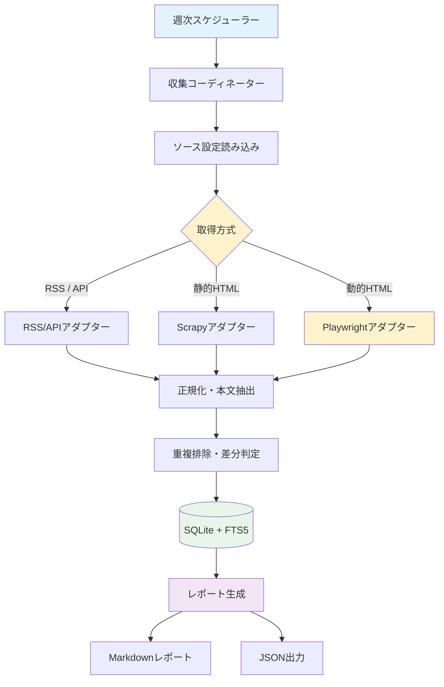
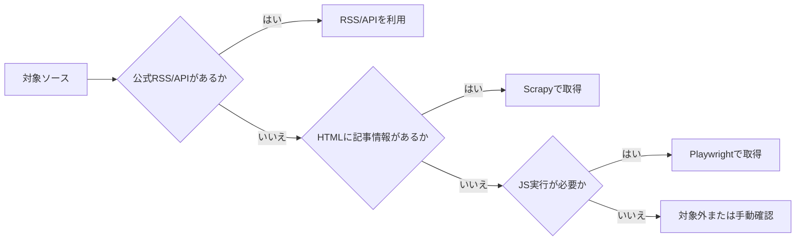
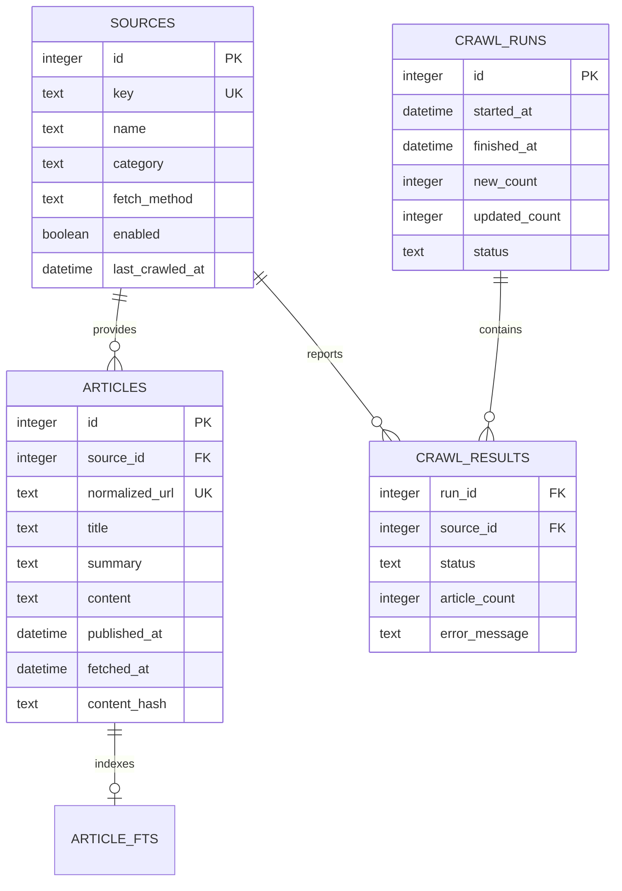

週1回程度のペースで効率的に最新トレンドやビジネス動向、技術動向をキャッチアップできるよう、国内外の主要なAI情報ソースから記事情報を収集し、SQLiteに保存してMarkdownレポートを生成するシステムの設計書です。

---

## 1. システムアーキテクチャ

システム全体は、取得方式に応じたアダプター（RSS/API、Scrapy、Playwright）と、SQLite + FTS5 を用いたデータ永続化層、および Markdown レポート生成層で構成されます。

### 取得方式の判断フロー

---

## 2. データベース設計 (SQLite + FTS5)

データベースには SQLite（WALモード）を採用し、FTS5 による全文検索機能を組み込みます。

---

## 3. MVP 対象ソース（初期5サイト）

MVP では以下の 5 サイトを対象として収集パイプラインを確立します。

| No | ソース名 | カテゴリ | 取得方式 | 対象URL |
| --- | --- | --- | --- | --- |
| 1 | OpenAI News | 公式発信 | RSS / API | `https://openai.com/news/` |
| 2 | Google DeepMind Blog | 公式発信 | RSS / API | `https://deepmind.google/discover/blog/` |
| 3 | Hugging Face Blog | 研究・OSS | RSS / Feed | `https://huggingface.co/blog/feed.xml` |
| 4 | TechCrunch AI | 海外メディア | RSS / Scrapy | `https://techcrunch.com/category/artificial-intelligence/` |
| 5 | Ledge.ai | 国内メディア | RSS / Scrapy | `https://ledge.ai/` |

---

## 4. 将来の候補情報ソース一覧 (25〜30サイト)

MVP 検証完了後、以下の候補リストから段階的に登録を拡大します。

### 🌍 海外サイト（英語圏・グローバル動向）

#### 【総合テック・AIメディア】

1. **TechCrunch (AI Section)**
   - URL: `https://techcrunch.com/category/artificial-intelligence/`
   - 特徴: スタートアップの資金調達、新プロダクト発表、生成AIトレンドの速報に強い。
2. **VentureBeat (AI)**
   - URL: `https://venturebeat.com/category/ai/`
   - 特徴: 企業導入事例やエンタープライズ視点でのAI活用動向に強み。
3. **MIT Technology Review (AI)**
   - URL: `https://www.technologyreview.com/topic/artificial-intelligence/`
   - 特徴: 信頼性の高い深掘り取材、倫理・社会への影響を多角的に分析。
4. **Wired (AI)**
   - URL: `https://www.wired.com/tag/artificial-intelligence/`
   - 特徴: AI規制、社会的影響、カルチャー視点の分析記事。
5. **The Verge (AI)**
   - URL: `https://www.theverge.com/ai-artificial-intelligence`
   - 特徴: コンシューマー向け製品、大手テック企業の動向、分かりやすい解説。
6. **AI News**
   - URL: `https://www.artificialintelligence-news.com/`
   - 特徴: エンタープライズAI、機械学習、エコシステム全体のニュース。
7. **Ars Technica (AI)**
   - URL: `https://arstechnica.com/tag/ai/`
   - 特徴: 技術的バックグラウンドを持つライターによる精緻な検証記事。
8. **Forbes (AI)**
   - URL: `https://www.forbes.com/ai/`
   - 特徴: 投資、ビジネス戦略、CxO向けインサイト。

#### 【公式発信・研究論文】

9. **OpenAI Blog**
   - URL: `https://openai.com/news/`
   - 特徴: モデル更新、新機能、安全性に関する一次情報。
10. **Google DeepMind Blog**
    - URL: `https://deepmind.google/discover/blog/`
    - 特徴: 最先端の研究成果、マルチモーダルモデル開発などの公式発表。
11. **Anthropic News / Research**
    - URL: `https://www.anthropic.com/news`
    - 特徴: Claude関連のアップデート、AIアライメントや安全性研究。
12. **Hugging Face Blog**
    - URL: `https://huggingface.co/blog`
    - 特徴: オープンソースモデル、コミュニティの技術トレンドや実装例。
13. **arXiv (cs.AI / cs.LG)**
    - URL: `https://arxiv.org/list/cs.AI/recent`
    - 特徴: 世界中の最先端論文がプレプリントとして最速で掲載される場。

#### 【週次チェックに最適なニュースレター・まとめ】

14. **The Rundown AI**
    - URL: `https://www.therundown.ai/`
    - 特徴: 最大規模の読者を抱えるAIニュースレター。要点が簡潔。
15. **The Batch (DeepLearning.AI)**
    - URL: `https://www.deeplearning.ai/the-batch/`
    - 特徴: Andrew Ng氏主宰。技術的・客観的視点での週次まとめ。
16. **Import AI (Jack Clark)**
    - URL: `https://importai.substack.com/`
    - 特徴: 政策・研究・社会実装に関する質の高い週次分析。
17. **Last Week in AI**
    - URL: `https://lastweekin.ai/`
    - 特徴: 1週間の出来事を包括的にまとめたニュース＆ポッドキャスト。
18. **MarkTechPost**
    - URL: `https://www.marktechpost.com/`
    - 特徴: オープンソースフレームワークやモデル実装チュートリアルの紹介が豊富。
19. **TLDR AI**
    - URL: `https://tldr.tech/ai`
    - 特徴: 論文から製品発表までを短い箇条書きで把握可能。

---

### 🇯🇵 日本国内サイト（国内事例・日本語解説）

20. **Ledge.ai**
    - URL: `https://ledge.ai/`
    - 特徴: 国内最大級のAI特化メディア。最新技術からビジネス活用事例まで幅広くカバー。
21. **AINOW**
    - URL: `https://ainow.ai/`
    - 特徴: 生成AIや国内スタートアップ動向のキャッチアップに最適。
22. **ITmedia AI+**
    - URL: `https://www.itmedia.co.jp/aiplus/`
    - 特徴: 国内エンタープライズの導入事例や大手ベンダーの動向解説。
23. **AI Market**
    - URL: `https://ai-market.jp/category/news/`
    - 特徴: AIエージェントや生成AIのビジネス活用ニュースを継続配信。
24. **AIsmiley**
    - URL: `https://aismiley.co.jp/ai-news_category/generative-ai/`
    - 特徴: 国内のAI製品比較やユースケース情報に強み。
25. **日経クロステック（AI・機械学習）**
    - URL: `https://xtech.nikkei.com/`
    - 特徴: 産業への影響、法規制、政策動向などを交えた技術解説。
26. **日本経済新聞 電子版（AI特集）**
    - URL: `https://www.nikkei.com/`
    - 特徴: 国内外の大型投資、株式市場やマクロ経済へのインパクト把握。
27. **AI-Media**
    - URL: `https://ai-media.co.jp/category/latest/`
    - 特徴: 業界動向や企業発表の速報を専門的な視点で配信。
28. **AI総研**
    - URL: `https://metaversesouken.com/ai/generative_ai/media/`
    - 特徴: 生成AIの活用ノウハウやトレンドまとめ記事が充実。
29. **ZDNET Japan（AI・機械学習）**
    - URL: `https://japan.zdnet.com/topic/ai/`
    - 特徴: グローバルなITビジネス動向の日本語翻訳・解説記事が多数。
