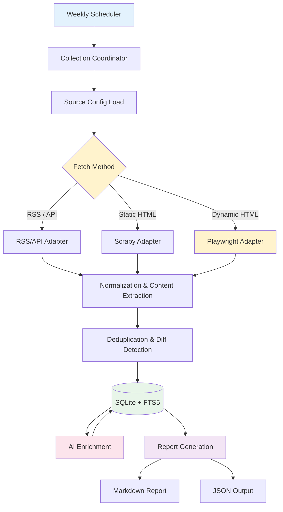

# News Crawler (news_crawler)

An automated crawling system for regularly collecting, translating, summarizing, and reporting the latest AI trends and technical developments.

---

## Overview

This system automatically collects new articles from major AI information sources (official blogs, tech media, research institutions, newsletters), structures and saves them to SQLite (with FTS5 support), and generates weekly Markdown reports. It also features AI-powered Japanese translation and summarization.

### Key Features

- **Hybrid Fetching**: Selects the optimal method per source from RSS/API, Hugging Face Hub API, Scrapy (static HTML), and Playwright (dynamic JS rendering).
- **AI Translation & Summarization**: Translates and summarizes English articles to Japanese via AIA Proxy, enabling offline search and report generation.
- **Differential Crawling & Deduplication**: Differential collection of new articles based on normalized URLs and content hashes.
- **SQLite + FTS5 Full-Text Search**: Fast local full-text search in both English and Japanese.
- **Flexible Configuration**: Centralized management of target sources, selectors, and fetch frequency via `config/sources.yaml`.
- **Weekly Markdown Report Output**: Automatic generation of categorized and source-specific new article summaries.

---

## System Architecture



---

## Requirements

- **Python**: 3.13+
- **Package Manager**: `uv`
- **Runtime Environment**: Linux / WSL2 (Ubuntu 22.04+)
- **Node.js**: 20+ (for documentation linting)

---

## Setup

### 1. Clone Repository and Install Dependencies

```bash
cd ~/dev/news_crawler

# Sync Python dependencies
uv sync

# Install Playwright browsers (first time only)
# For corporate proxy environments, set environment variable to bypass SSL certificate errors
NODE_TLS_REJECT_UNAUTHORIZED=0 uv run playwright install chromium
```

### 2. Prepare Configuration Files

```bash
# Create production config from sample
cp config/sources.example.yaml config/sources.yaml
```

---

## Usage

### Running Crawls

```bash
# Crawl all enabled sources
uv run news-crawler crawl

# Crawl specific source only
uv run news-crawler crawl --source openai

# dry-run (fetch verification without DB persistence)
uv run news-crawler crawl --dry-run
```

### Current Sources (18 enabled + 12 disabled = 30 sites)

| Category | Source Count | Source Names |
| --- | --- | --- |
| official | 5 | OpenAI News, Google DeepMind Blog, Hugging Face Blog, Meta Llama, Mistral AI |
| media | 5 | TechCrunch AI, MIT Technology Review (AI), AI News, Ars Technica (AI), MarkTechPost |
| domestic | 3 | Ledge.ai (Playwright), AINOW, AIsmiley |
| chinese_official | 3 | DeepSeek (Hugging Face), Qwen (Hugging Face), Qwen Blog |
| newsletter | 2 | Import AI (Jack Clark), Last Week in AI |

### Disabled Sources (Access Restricted or No RSS Feed)

The following sites are disabled due to access restrictions, missing RSS feeds, or SSL certificate errors. See `Idea_memo.md` for details.

- VentureBeat (AI)
- Wired (AI)
- The Verge (AI)
- ITmedia AI+
- AI Market
- AI総研
- ZDNET Japan (AI)
- The Rundown AI
- The Batch (DeepLearning.AI)
- TLDR AI
- Anthropic (Hugging Face)
- THUDM (Hugging Face)

---

### Hugging Face Model Information Retrieval

Specifying `fetch_method: "huggingface"` retrieves the latest 20 models from the target account via Hugging Face Hub's public API. Currently targets DeepSeek and Qwen.

Retrieved items include model ID, creation date, pipeline, library, tags, likes, and download counts. These are public model information on Hugging Face, not official company news releases.

```yaml
sources:
  deepseek_hf:
    name: "DeepSeek (Hugging Face)"
    category: "chinese_official"
    fetch_method: "huggingface"
    enabled: true
    base_url: "https://huggingface.co/deepseek-ai"
```

```bash
uv run news-crawler crawl --source deepseek_hf
uv run news-crawler crawl --source qwen_hf
```

### AI Translation & Summarization (Optional)

Use AIA Proxy to translate and summarize collected English articles to Japanese.

```bash
# Enable AI translation/summarization (set ai.enabled: true in config/crawler.yaml)
uv run news-crawler enrich --days 7 --limit 50

# Retry failed articles
uv run news-crawler enrich --days 7 --retry-failed
```

AI processing features:

- **Post-Collection Processing**: Original content is saved to DB first, then AI-processed, ensuring original content is preserved even during AI failures.
- **Differential Processing**: Only processes new articles and content-changed articles, skipping unchanged articles.
- **Customizable System Prompt**: Adjust output requirements and summary styles via `ai.system_prompt` in `config/crawler.yaml`.
- **Explicit Reprocessing Control**: To re-enrich already processed articles after prompt updates, bump `ai.prompt_version` in `config/crawler.yaml` (e.g., `"1"` → `"2"`).
- **Offline Search**: Japanese titles and summaries are saved to DB, enabling offline Japanese search.
- **Rate Limit Handling**: Configurable request intervals to avoid API rate limits.

### Report Generation

Generates a Markdown report from collected articles. Visualization with word clouds and word frequency distribution (pie charts) is enabled by default.

```bash
# Generate weekly report for last 7 days (with visualization)
uv run news-crawler report

# Custom period (e.g., last 30 days, Top 15 words)
uv run news-crawler report --days 30 --top-n 15

# Date range specification
uv run news-crawler report --start-date 2026-09-01 --end-date 2026-09-14

# Predefined periods (week/month/quarter)
uv run news-crawler report --period month

# Generate text-only report without visualization
uv run news-crawler report --no-visualize
```

Report visualization features:

- **Multi-language Analysis**: Analyzes Japanese (morphological analysis via SudachiPy) and original text (alphanumeric tokenization) separately.
- **Asset Management**: Images are saved to an asset directory based on the report filename (e.g., `report_assets/`), referenced via relative paths in Markdown.
- **Rich Frontmatter**: Analysis criteria (period, Top N, visualization status, etc.) are recorded in the report's Frontmatter in YAML format.
- **Japanese Font Support**: Automatically detects common Japanese fonts on the system. You can manually specify a font path via `report.japanese_font_path` in `config/crawler.yaml`.

### Article Search (FTS5 Full-Text Search)

```bash
# Keyword search (English and Japanese supported)
uv run news-crawler search "Claude 3.7"
uv run news-crawler search "AIモデル"

# Category-filtered search
uv run news-crawler search "Agent" --category official
```

### Source List Verification

```bash
uv run news-crawler list-sources
```

### Database Statistics

```bash
# View database statistics including AI processing status
uv run news-crawler stats
```

---

## Documentation & Code Verification (Lint & Test)

### Python Testing & Static Analysis

```bash
# Run tests
uv run pytest

# Static analysis (Ruff)
uv run ruff check .

# Type checking (Mypy)
uv run mypy src
```

### Documentation Linting

```bash
# Markdown linting (markdownlint)
npm run lint

# Japanese text linting (textlint)
npm run lint:fix
```

---

## Project Structure

```text
news_crawler/
├── src/news_crawler/
│   ├── adapters/          # Source-specific fetch adapters
│   ├── ai_processor.py    # AI enrichment processor
│   ├── cli.py             # Command-line interface
│   ├── config.py          # Configuration loader
│   ├── coordinator.py     # Crawl orchestration
│   ├── database.py        # SQLite + FTS5 repository
│   ├── models.py          # Data models
│   ├── normalizer.py      # URL/content normalization
│   ├── reporting.py       # Markdown report generator
│   ├── text_analyzer.py   # Morphological analysis & keyword extraction
│   ├── visualization.py   # Word cloud & chart generation
│   └── utils.py           # Utility functions
├── config/
│   ├── crawler.yaml        # Crawler & AI configuration
│   ├── sources.yaml        # Source definitions (not in git)
│   └── sources.example.yaml # Source template
├── tests/                  # Test suite
├── data/                   # SQLite database (gitignored)
└── output/                 # Generated reports
```

---

## Configuration

### Crawler Configuration (`config/crawler.yaml`)

```yaml
crawler:
  download_delay: 1.5        # Delay between requests (seconds)
  concurrent_requests: 4      # Max concurrent requests
  timeout_seconds: 30         # HTTP request timeout
  retry_times: 3              # Retry attempts for failed requests
  database_path: "data/articles.db"
  output_dir: "output"

report:
  visualize: true             # Enable visualization
  top_n: 20                    # Top N words for charts
  japanese_font_path: ""       # Path to Japanese font file (optional)
  output_assets_name: "assets" # Assets directory suffix
  wordcloud_width: 800         # Word cloud width
  wordcloud_height: 400        # Word cloud height

ai:
  enabled: false              # Enable AI enrichment
  proxy_url: "http://localhost:11434/v1"  # AIA Proxy URL
  model: "llama-3-3-70b-instruct"        # AI model
  request_interval: 2.0       # Delay between AI requests
  max_input_chars: 8000        # Max input characters per article
  max_articles_per_run: 50     # Max articles per enrich run
  prompt_version: "1"          # Bump version to reprocess completed articles
  system_prompt: |             # System prompt for translation/summarization
    You are a professional translator and summarizer. Your task is to process the provided article and output a JSON object with the following structure:

    {
      "title_ja": "Japanese translation of the article title",
      "summary_ja": "Japanese summary of the article content (2-3 sentences)"
    }

    Important guidelines:
    - Translate the title accurately to Japanese
    - Create a concise summary in Japanese (2-3 sentences)
    - If the article is already in Japanese, still provide a refined Japanese summary
    - Output ONLY the JSON object, no additional text
    - Ensure the JSON is valid and properly formatted
```

### Source Configuration (`config/sources.yaml`)

```yaml
sources:
  openai:
    name: "OpenAI News"
    category: "official"
    fetch_method: "rss"
    enabled: true
    base_url: "https://openai.com/news/"
    feed_url: "https://openai.com/news/rss.xml"
```

---

## Design Decisions

1. **Fetch Method Priority**:
   - `RSS / API` preferred (low load, high stability)
   - `Scrapy` for static HTML when RSS unavailable
   - `Playwright` only when JS rendering is essential

2. **Data Persistence (SQLite + FTS5)**:
   - Embeddings and pgvector are out of initial scope
   - SQLite FTS5 for fast keyword search
   - `data/articles.db` is gitignored

3. **Public Repository Security & Cleanliness**:
   - No secrets (API keys, webhook URLs) or collected data committed to Git
   - `config/sources.example.yaml` as public template
   - `config/sources.yaml` for operational configuration
   - Windows Node.js dependency eliminated, WSL2-native environment

---

## License

MIT License
