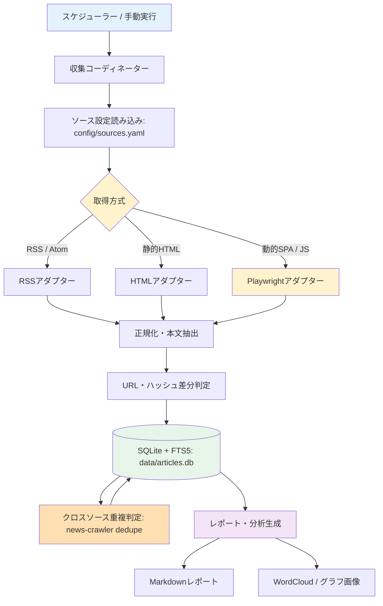

# News Crawler (news_crawler) — 競馬ニュース収集・分析

競馬ニュース・コラム・速報を定期的に自動収集・形態素解析・要約・レポート化するスクレイピングシステムです。本ブランチ（`mac-local`）は自宅の macOS 環境向けに、競馬ニュース収集・分析用として最適化されています。

---

## 概要

主要な競馬情報メディア（netkeiba、日刊スポーツ競馬、JRA公式サイト、サンスポ、スポニチ、競馬ラボ、東スポ競馬など）から新着記事を自動収集し、SQLite（FTS5対応）に構造化して保存、Markdownレポートおよび単語頻度の可視化（ワードクラウド等）を生成します。また、ローカルLLM（Ollama等）を用いた要約機能や、競馬の専門用語辞書を用いた形態素解析に対応しています。

### 主な特徴

- **ハイブリッド取得**: RSS/Atomフィード、静的HTMLスクレイピング、動的JSレンダリング（Playwright）をサイトの特性に応じて自動適用。
- **競馬の専門用語への対応**: SudachiPy および競馬用語の辞書（競走馬名・騎手名・レース名等）による高精度な日本語の形態素解析と頻出トレンド抽出。
- **差分クロール・重複排除**: 正規化URLおよびコンテンツハッシュ（SHA-256）による未取得記事の差分収集。加えて、正規化タイトル完全一致によるクロスソース重複検出（`news-crawler dedupe`）で、別サイトが同じ発表を独自記事化したケースも代表記事へ集約。
- **SQLite + FTS5 全文検索**: 高速なローカル全文検索により、馬名や騎手名での横断検索が可能。
- **柔軟な設定管理**: `config/sources.yaml` で対象ソース・セレクター・取得頻度を一元管理。
- **日付別ダイジェスト**: AI要約付きの記事一覧を `<年>/<YYYY-MM-DD>.md` として出力（`digest`）。
- **Markdownレポート出力**: カテゴリ別・ソース別の新着記事サマリーおよびワードクラウド画像を自動生成。

---

## システムアーキテクチャ



---

## 必要要件

- **OS**: macOS (Apple Silicon / Intel) または Linux / WSL2
- **Python**: 3.13 以上
- **パッケージマネージャ**: `uv`
- **Node.js**: 20 以上（ドキュメントLint用）

---

## セットアップ

### 1. リポジトリの準備と依存関係インストール

```bash
cd ~/Projects/Dev/news_crawler

# Python 依存関係の同期
uv sync

# Playwright ブラウザのインストール（動的サイト取得用、初回のみ）
uv run playwright install chromium
```

### 2. 設定ファイルの確認

`config/sources.yaml` に競馬ニュースソースが定義されています。

```bash
# 登録ソース一覧の確認
uv run news-crawler list-sources
```

---

## 使い方

### クロールの実行

```bash
# 全ソースのクロール実行
uv run news-crawler crawl

# 特定ソースのみクロール（例: netkeiba）
uv run news-crawler crawl --source netkeiba

# dry-run（DB保存なしで取得動作のみ確認）
uv run news-crawler crawl --dry-run
```

### 現在の登録ソース一覧（有効8 + 無効3 = 計11サイト）

| キー | サイト名 | カテゴリ | 取得方式 | 状態 |
| --- | --- | --- | --- | --- |
| `netkeiba` | netkeiba ニュース＆コラム | media | RSS | 有効 |
| `nikkansports` | 日刊スポーツ 競馬 | sports_paper | RSS | 有効 |
| `google_news_keiba` | Google News (競馬) | aggregator | RSS | 無効 |
| `google_news_jra` | Google News (JRA) | aggregator | RSS | 無効 |
| `jra` | JRA 公式ニュース | official | HTML | 有効 |
| `radionikkei` | ラジオNIKKEI 競馬実況Web | media | HTML | 有効 |
| `sponichi` | スポニチ競馬Web | sports_paper | HTML | 有効 |
| `sanspo` | サンスポZBAT! 中央競馬 | sports_paper | HTML | 有効 |
| `keibalab` | 競馬ラボ | media | HTML | 有効 |
| `tospo` | 東スポ競馬 | sports_paper | Playwright | 有効 |
| `kaba_tsu_jra` | TSL JRA指数予想 | prediction | RSS | 無効 |

> `google_news_keiba` / `google_news_jra` は、同一の配信記事を Yahoo!ニュース・UMATOKU・各地方紙など数十のポータル名義で重複配信するため無効化しています（2026-09-18）。個別ニュースサイトの一次情報は `netkeiba` 等の他ソースで収集済みです。
>
> `sources.yaml` で `enabled: false` にしたソースは、`report` コマンドが既定で自動除外します（無効化前にDBへ蓄積済みの過去記事も対象）。手動で `--exclude-source` を指定する必要はありません。

---

### 競馬の専門用語辞書の構築（オプション）

`scripts/infer_keiba_crowns.py` と `scripts/build_keiba_dict.py` を用いて、冠名を中心とした小型の Sudachi ユーザー辞書をビルドできます。手順は次の3段階です。

```bash
# 1. 冠名候補の抽出 (PGPASSWORD は環境変数で事前に設定しておくこと)
uv run python scripts/infer_keiba_crowns.py

# 2. config/keiba_crowns.csv を開き、誤検出・一般語などの不要行を削除する
#    (残った全データ行が承認済み冠名として使われます)

# 3. 承認済み冠名 + 手動用語CSV + DBカテゴリでビルド
uv run python scripts/build_keiba_dict.py dict/keiba_dict.csv \
  --crowns config/keiba_crowns.csv \
  --pckeiba --categories jockeys,races,trainers,owners
```

候補の抽出では、人手レビュー可能な件数に絞るため、既定で DB 出現75頭以上、前方冠名を馬主15名以下、後方冠名を馬主3名以下にフィルタします。後方候補は特に一般語の語尾を拾いやすく、多数馬主にまたがる文字列は冠名ではなく一般語の断片である可能性が高いため、このフィルタで抑制します。`--min-db-count` / `--max-prefix-owners` / `--max-suffix-owners` で既定値を上書きできます。

承認済み冠名は、レポート生成時にカタカナ連続区間の先頭・末尾から直接抽出されます。前方・後方冠名を辞書へ登録するだけでは、未知語である馬名全体を Sudachi が分割できないためです。生成されるユーザー辞書は冠名・騎手名・レース名・調教師名・馬主名などの用語をそのまま認識するために引き続き利用します。

生成される `dict/keiba_user.csv` / `dict/keiba_user.dic`（2万語超過時は連番分割）と `archive/` は Git 管理外です。`dict/uma.csv` は冠名候補の裏付け用の入力であり、最終辞書には直接含まれません。

---

### レポートの生成と単語頻度の可視化

収集した記事からMarkdownレポートを生成します。既定でワードクラウドと単語頻度パイチャートが作成されます。

```bash
# 直近7日間のレポートを生成（可視化あり）
uv run news-crawler report

# 期間指定（例: 直近30日間、頻出上位15単語）
uv run news-crawler report --days 30 --top-n 15

# 日付範囲指定
uv run news-crawler report --start-date 2026-09-01 --end-date 2026-09-14

# 月単位レポート
uv run news-crawler report --period month

# 可視化画像なしでテキストのみ出力
uv run news-crawler report --no-visualize

# sources.yaml で enabled: false のソースは自動で除外されるため、
# それ以外を追加で除外したい場合のみ --exclude-source を指定する
uv run news-crawler report --period month --exclude-source some_other_source

# クロスソース重複記事（news-crawler dedupe で検出済み）を除外
uv run news-crawler report --period month --exclude-duplicates
```

「原文」ワードクラウド・パイチャートは、まず SudachiPy による日本語の形態素解析を試み、結果が空の場合のみ英数字抽出にフォールバックします。日本語フォントは `_detect_japanese_font()` が代表的なインストールパスを自動探索し、見つからない場合は matplotlib が認識済みのフォント一覧から CJK 対応フォント（Hiragino・Noto Sans JP 等）を名前で検索します。特定のフォントを使いたい場合は `config/crawler.yaml` の `report.japanese_font_path` で明示指定できます。

---

### 重複記事の検出（クロスソース Dedupe）

同一URLの重複は差分クロールで排除されますが、**別々のサイトが同じプレスリリースを独自記事化した場合**（例: netkeiba とスポニチが同じ発表を同一タイトルで別記事として配信）は検出できません。`news-crawler dedupe` は、正規化タイトルが完全一致する記事を異なるソース間で横断的に検索し、`published_at` が最も早い記事を代表として残りを重複マークします。

```bash
# 直近30日を対象に、DBへ書き込まず検出結果だけプレビュー（既定）
uv run news-crawler dedupe --period month

# 検出結果をDBに反映（duplicate_of_id / duplicate_score を保存）
uv run news-crawler dedupe --period month --apply

# 短いタイトルの誤検出を避ける閾値を調整（既定15文字）
uv run news-crawler dedupe --period month --apply --min-title-len 20
```

- 冪等な処理のため、日付抽出バグを直した後などに何度でも再実行できます（実行ごとに対象期間の判定を最初から計算し直します）。
- 重複マークされた記事は `news-crawler enrich`（AI要約）の対象から自動的に除外され、`report --exclude-duplicates` でレポートからも除外できます。
- 現状はタイトル完全一致のみに対応（`duplicate_score` は常に `1.0`）。将来的に埋め込みベースの類似度判定を追加する場合も、同じカラムに小数スコアを保存できるよう設計されています。

---

### レースコメント出力（TARGET frontier JV 向け一括インポート）

クロールしたニュースから**レース単位のニュース・騎手談話**を抽出し、JRA-VAN「TARGET frontier JV」のレースコメント一括登録（FAQ 612準拠）に対応した CSV（Shift_JIS / CP932）を出力できます。

```bash
# 最新開催日の全レースコメントを一括出力（既定は1レース1行ベタ書き・CP932）
uv run news-crawler export-comments

# 特定レースのみを抽出（例: ながつきステークス）
uv run news-crawler export-comments --race ながつき

# 日付・競馬場を指定して出力
uv run news-crawler export-comments --date 2026-09-19 --venue 中山

# 出力先パスを指定（TARGET の TXT フォルダへ直接出力可能）
uv run news-crawler export-comments --date 2026-09-19 -o output/my_comments.csv

# 開催回次・日次を手動オーバーライド（例: 中山4回3日、阪神4回3日）
uv run news-crawler export-comments --date 2026-09-12 --schedule "中山:4:3,阪神:4:3"
```

- **レース単位での紐付け**: 競馬場とレース番号（1〜12R）が特定できるレース結果・騎手コメントのみを抽出し、一般コラムやWIN5等は自動除外されます。
- **16桁レースID（新仕様）**: `YYYYMMDDPPKKNNRR`（西暦+月日+場コード+回次+日次+レース番号）を自動算出して1レース1行でCSV生成します。
- **TARGET完全準拠の1行ベタ書き**: TARGETのCSVパーサー仕様に配慮し、コメント内の改行は半角スペースで連結された1行ベタ書き（`--single-line` 既定）でShift_JIS（CP932）出力されます（`--no-single-line` で改行保持形式も選択可能）。
- **開催回次・日次の自動解決**: JRA公式「開催競馬場・今日の出来事」ニュースから当日の回次・日次を自動推定します。手動オーバーライドが必要な場合は `--schedule` で指定できます。
- **TARGET取り込み**: TARGET メインメニュー > 「ファイルからのコメント等一括登録」 > 「レースコメントのインポート」から本CSVを指定することで、出馬表や成績画面に自動表示されます。

---

### 記事の検索 (FTS5 全文検索)

SQLite の FTS5 全文検索インデックスを利用して、蓄積された記事を瞬時に検索できます。

```bash
# 馬名やレース名でキーワード検索
uv run news-crawler search "天皇賞"
uv run news-crawler search "武豊"

# カテゴリ絞り込み検索（公式発表のみ等）
uv run news-crawler search "重賞" --category official
```

---

### AI要約・翻訳（`enrich`）

DB に保存済みの記事（タイトル・要約・本文）を LLM に渡し、**日本語タイトルと 2〜3 文の日本語要約**を `articles.title_ja` / `summary_ja` に書き戻します（元の記事は変更しません。URL を開いて全文を取りに行くことはしないため、RSS 抜粋しか無い記事の要約はその範囲に限られます）。

```bash
# 直近7日の未処理記事を最大50件処理
uv run news-crawler enrich --days 7 --limit 50

# 失敗した記事の再試行
uv run news-crawler enrich --days 7 --retry-failed

# 使うLLMを1つに固定（フォールバックしない）
uv run news-crawler enrich --llm gemini
```

**LLM エンドポイントと自動フォールバック**: `config/crawler.yaml` の `ai.endpoints` に OpenAI 互換のエンドポイントを定義し、`ai.endpoint_order` の先頭から順に、「到達でき、対象モデルがロード済み」の最初のものを使います（実行時に `LLM endpoint: ...` を表示）。

| 順 | 名前 | 接続先 | モデル |
| --- | --- | --- | --- |
| 1 | `lmstudio_12b` | `localhost:1234`（LM Studio。LM Link 経由でリモート機のモデルが見える） | `google/gemma-4-12b-qat` |
| 2 | `lmstudio_local` | `localhost:1234` | `google/gemma-4-e4b` |
| 明示指定 | `gemini` | Google Gemini API（OpenAI 互換） | `gemini-2.5-flash-lite` |

- `gemini` は既定の順序に入れていません（記事本文が外部に送られ、従量課金のため）。`--llm gemini` で明示したときだけ使います。API キーは `.env` に `GEMINI_API_KEY=...` と書きます（`.env` は Git 管理外）。
- `endpoints` を空にすると、従来どおり `ai.proxy_url` / `ai.model`（環境変数 `AIA_PROXY_URL` / `AIA_MODEL` で上書き可）の単一エンドポイントで動きます。
- **思考（reasoning）モデルでは `ai.max_tokens` を大きくします**。gemma-4 は思考トークンも `max_tokens` を消費し、上限が小さいと返答が空になって全件失敗します（既定 500 → `crawler.yaml` では 3000）。エンドポイントごとに `max_tokens` で上書きできます。
- 速度の目安は 12b で約 15〜20 秒/件、e4b で約 10 秒/件です。全件処理は数時間かかるため、`--limit` で分けるかバックグラウンドで実行してください。

---

### 日付別ダイジェスト（`digest`）

記事を公開日ごとにまとめ、AI要約付きの Markdown を**日付ごと・年ごとのフォルダ**に出力します。

```bash
uv run news-crawler digest                                   # 直近7日
uv run news-crawler digest --days 30
uv run news-crawler digest --start-date 2026-09-18 --end-date 2026-09-18   # 特定の日
uv run news-crawler digest --only-summarized                 # AI要約済みの記事だけ
uv run news-crawler digest -o /tmp/digests                   # 出力先の変更（試すときはこちら）
```

- 出力先は `<report.output_dir>/<YYYY>/<YYYY-MM-DD>.md`。**冪等**で、再実行はその日のファイルを上書きします（`enrich` の進行に合わせて流し直せます）。
- 内容は front matter（`total_articles` / `ai_summarized` / `llm_models`）→ソース別（件数の多い順）→時刻の新しい順の「日本語タイトル（リンク）＋要約」。AI 未処理の記事は原題とリンクのみです。
- **日単位で丸ごと出力**します。`--days N` は N 日前の同時刻から始まりますが、開始日は 0:00 に広げて取ります。指定範囲の外の日に振り分けられた記事は書き出さず、警告（`Skipped ...`）を出します（欠けたファイルで完全版を上書きしないため）。
- 重複記事（`dedupe --apply` 済み）と `enabled: false` のソースは既定で除外します。
- **既知の不具合**: スクレイパーが公開日を誤って未来（例: 2028-08-09）にした記事は、公開日で絞り込むためどの日のファイルにも入りません（2026-09-20 時点で競馬ラボの告知記事 1 件）。原因は未調査です。

---

## テストとコード品質

```bash
# Python 単体テスト (Pytest)
uv run pytest

# Python 静的解析 (Ruff)
uv run ruff check .

# Python 型チェック (Mypy Strict)
uv run mypy src

# ドキュメント Lint (Markdown & textlint)
npm run lint
npm run lint:fix
```

---

## ディレクトリ構成

```text
news_crawler/
├── pyproject.toml              # Python プロジェクト定義 (uv)
├── uv.lock                     # 依存バージョン固定ロックファイル
├── package.json                # npm スクリプト・Lint 定義
├── config/
│   ├── sources.yaml            # 競馬ニュース収集ソース設定
│   ├── crawler.yaml            # クローラー共通・AI・レポート設定
│   ├── keiba_keywords.yaml     # 競馬キーワード・カテゴリ設定
│   ├── keiba_crowns.csv        # 冠名候補 (人手で不要行を削除して確定)
│   └── sudachi.json            # Sudachi 形態素解析設定
├── dict/                       # ユーザー辞書用CSV / バイナリ格納先
├── scripts/
│   ├── build_keiba_dict.py     # 競馬辞書ビルドスクリプト (PC-KEIBA連携対応)
│   └── infer_keiba_crowns.py   # 冠名候補抽出スクリプト (PC-KEIBA連携)
├── src/
│   └── news_crawler/
│       ├── __init__.py
│       ├── cli.py              # CLI エントリポイント
│       ├── coordinator.py      # クロール実行コーディネーター
│       ├── config.py           # 設定ローダー
│       ├── models.py           # Pydantic データモデル
│       ├── database.py         # SQLite + FTS5 リポジトリ
│       ├── normalizer.py       # URL・本文・タイトル正規化
│       ├── dedupe.py           # クロスソース重複検出（正規化タイトル完全一致）
│       ├── text_analyzer.py    # SudachiPy 形態素解析
│       ├── visualization.py    # WordCloud / グラフ画像生成
│       ├── reporting.py        # Markdown レポート生成
│       ├── digest.py           # 日付別ダイジェスト（<年>/<日付>.md）
│       ├── ai_processor.py     # AI要約プロセッサー
│       └── adapters/           # 取得アダプター群 (RSS, HTML, Playwright等)
├── tests/                      # テストコード
├── data/                       # SQLite DB 保存先 (articles.db)
└── output/                     # レポート・アセット出力先
```

---

## ライセンス

[MIT License](LICENSE) © 2026 asain
