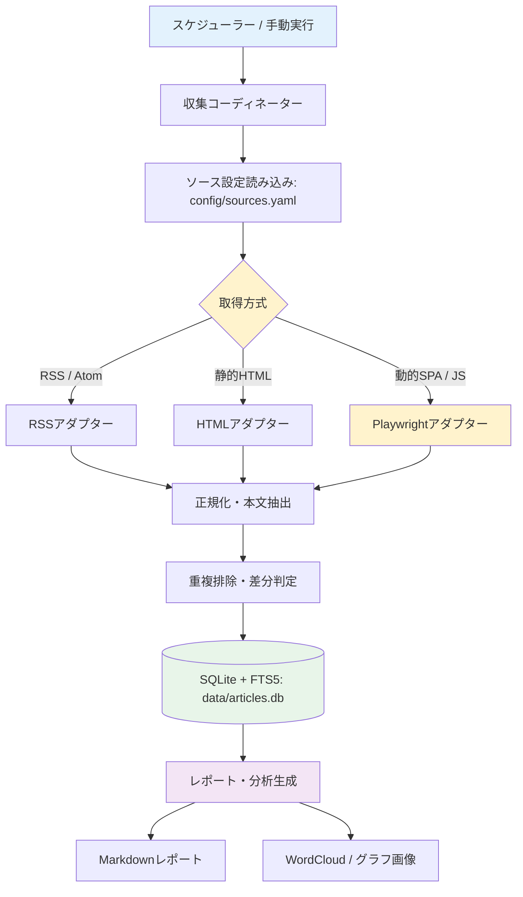

# News Crawler (news_crawler) — 競馬ニュース収集・分析

競馬ニュース・コラム・速報を定期的に自動収集・形態素解析・要約・レポート化するスクレイピングシステムです。本ブランチ（`mac-local`）は自宅の macOS 環境向けに、競馬ニュース収集・分析用として最適化されています。

---

## 概要

主要な競馬情報メディア（netkeiba、日刊スポーツ競馬、JRA公式サイト、サンスポ、スポニチ、競馬ラボ、東スポ競馬など）から新着記事を自動収集し、SQLite（FTS5対応）に構造化して保存、Markdownレポートおよび単語頻度の可視化（ワードクラウド等）を生成します。また、ローカルLLM（Ollama等）を用いた要約機能や、競馬の専門用語辞書を用いた形態素解析に対応しています。

### 主な特徴

- **ハイブリッド取得**: RSS/Atomフィード、静的HTMLスクレイピング、動的JSレンダリング（Playwright）をサイトの特性に応じて自動適用。
- **競馬の専門用語への対応**: SudachiPy および競馬用語の辞書（競走馬名・騎手名・レース名等）による高精度な日本語の形態素解析と頻出トレンド抽出。
- **差分クロール・重複排除**: 正規化URLおよびコンテンツハッシュ（SHA-256）による未取得記事の差分収集。
- **SQLite + FTS5 全文検索**: 高速なローカル全文検索により、馬名や騎手名での横断検索が可能。
- **柔軟な設定管理**: `config/sources.yaml` で対象ソース・セレクター・取得頻度を一元管理。
- **Markdownレポート出力**: カテゴリ別・ソース別の新着記事サマリーおよびワードクラウド画像を自動生成。

---

## システムアーキテクチャ



---

## 必要要件

- **OS**: macOS (Apple Silicon / Intel) または Linux / WSL2
- **Python**: 3.13 以上
- **パッケージマネージャ**: `uv`
- **Node.js**: 20 以上（ドキュメントLint用）

---

## セットアップ

### 1. リポジトリの準備と依存関係インストール

```bash
cd ~/Projects/Dev/news_crawler

# Python 依存関係の同期
uv sync

# Playwright ブラウザのインストール（動的サイト取得用、初回のみ）
uv run playwright install chromium
```

### 2. 設定ファイルの確認

`config/sources.yaml` に競馬ニュースソースが定義されています。

```bash
# 登録ソース一覧の確認
uv run news-crawler list-sources
```

---

## 使い方

### クロールの実行

```bash
# 全ソースのクロール実行
uv run news-crawler crawl

# 特定ソースのみクロール（例: netkeiba）
uv run news-crawler crawl --source netkeiba

# dry-run（DB保存なしで取得動作のみ確認）
uv run news-crawler crawl --dry-run
```

### 現在の登録ソース一覧（有効10 + 無効1 = 計11サイト）

| キー | サイト名 | カテゴリ | 取得方式 | 状態 |
| --- | --- | --- | --- | --- |
| `netkeiba` | netkeiba ニュース＆コラム | media | RSS | 有効 |
| `nikkansports` | 日刊スポーツ 競馬 | sports_paper | RSS | 有効 |
| `google_news_keiba` | Google News (競馬) | aggregator | RSS | 有効 |
| `google_news_jra` | Google News (JRA) | aggregator | RSS | 有効 |
| `jra` | JRA 公式ニュース | official | HTML | 有効 |
| `radionikkei` | ラジオNIKKEI 競馬実況Web | media | HTML | 有効 |
| `sponichi` | スポニチ競馬Web | sports_paper | HTML | 有効 |
| `sanspo` | サンスポZBAT! 中央競馬 | sports_paper | HTML | 有効 |
| `keibalab` | 競馬ラボ | media | HTML | 有効 |
| `tospo` | 東スポ競馬 | sports_paper | Playwright | 有効 |
| `kaba_tsu_jra` | TSL JRA指数予想 | prediction | RSS | 無効 |

---

### 競馬の専門用語辞書の構築（オプション）

`scripts/build_keiba_dict.py` を用いて、馬名・騎手名・レース名を含む Sudachi ユーザー辞書をビルドできます（PC-KEIBA Database からの直接生成にも対応）。

```bash
# CSV辞書からビルド
uv run python scripts/build_keiba_dict.py dict/keiba_dict.csv

# PC-KEIBA DBから馬名・騎手名等を抽出して構築
uv run python scripts/build_keiba_dict.py --pckeiba --categories horses,jockeys,races
```

---

### レポートの生成と単語頻度の可視化

収集した記事からMarkdownレポートを生成します。既定でワードクラウドと単語頻度パイチャートが作成されます。

```bash
# 直近7日間のレポートを生成（可視化あり）
uv run news-crawler report

# 期間指定（例: 直近30日間、頻出上位15単語）
uv run news-crawler report --days 30 --top-n 15

# 日付範囲指定
uv run news-crawler report --start-date 2026-09-01 --end-date 2026-09-14

# 月単位レポート
uv run news-crawler report --period month

# 可視化画像なしでテキストのみ出力
uv run news-crawler report --no-visualize
```

---

### 記事の検索 (FTS5 全文検索)

SQLite の FTS5 全文検索インデックスを利用して、蓄積された記事を瞬時に検索できます。

```bash
# 馬名やレース名でキーワード検索
uv run news-crawler search "天皇賞"
uv run news-crawler search "武豊"

# カテゴリ絞り込み検索（公式発表のみ等）
uv run news-crawler search "重賞" --category official
```

---

### AI要約・翻訳（オプション）

Ollama や OpenAI API 互換プロキシを介して、記事の日本語タイトル補正や短文要約を付与できます。

```bash
# AI要約を実行
uv run news-crawler enrich --days 7 --limit 50

# 失敗した記事の再試行
uv run news-crawler enrich --days 7 --retry-failed
```

---

## テストとコード品質

```bash
# Python 単体テスト (Pytest)
uv run pytest

# Python 静的解析 (Ruff)
uv run ruff check .

# Python 型チェック (Mypy Strict)
uv run mypy src

# ドキュメント Lint (Markdown & textlint)
npm run lint
npm run lint:fix
```

---

## ディレクトリ構成

```text
news_crawler/
├── pyproject.toml              # Python プロジェクト定義 (uv)
├── uv.lock                     # 依存バージョン固定ロックファイル
├── package.json                # npm スクリプト・Lint 定義
├── config/
│   ├── sources.yaml            # 競馬ニュース収集ソース設定
│   ├── crawler.yaml            # クローラー共通・AI・レポート設定
│   ├── keiba_keywords.yaml     # 競馬キーワード・カテゴリ設定
│   └── sudachi.json            # Sudachi 形態素解析設定
├── dict/                       # ユーザー辞書用CSV / バイナリ格納先
├── scripts/
│   └── build_keiba_dict.py     # 競馬辞書ビルドスクリプト (PC-KEIBA連携対応)
├── src/
│   └── news_crawler/
│       ├── __init__.py
│       ├── cli.py              # CLI エントリポイント
│       ├── coordinator.py      # クロール実行コーディネーター
│       ├── config.py           # 設定ローダー
│       ├── models.py           # Pydantic データモデル
│       ├── database.py         # SQLite + FTS5 リポジトリ
│       ├── normalizer.py       # URL・本文正規化
│       ├── text_analyzer.py    # SudachiPy 形態素解析
│       ├── visualization.py    # WordCloud / グラフ画像生成
│       ├── reporting.py        # Markdown レポート生成
│       ├── ai_processor.py     # AI要約プロセッサー
│       └── adapters/           # 取得アダプター群 (RSS, HTML, Playwright等)
├── tests/                      # テストコード
├── data/                       # SQLite DB 保存先 (articles.db)
└── output/                     # レポート・アセット出力先
```

---

## ライセンス

[MIT License](LICENSE) © 2026 asain
