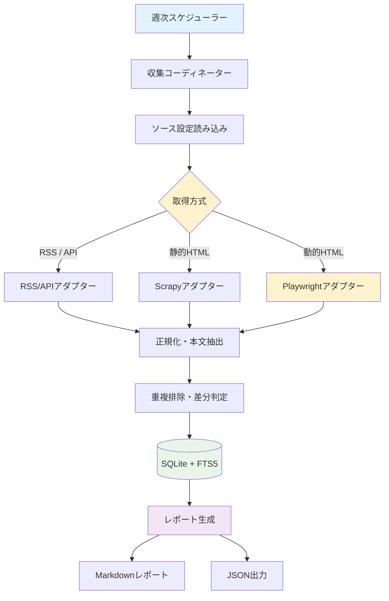

# AI Scraper (ai_scraper)

AI最新トレンド・技術動向を定期的に自動収集・要約・レポート化するスクレイピングシステムです。

---

## 概要

国内外の主要AI情報ソース（公式ブログ、テックメディア、研究機関、ニュースレター）から新着記事を自動収集し、SQLite（FTS5対応）に構造化して保存、週次Markdownレポートを生成します。

### 主な特徴

- **ハイブリッド取得**: RSS/API、Scrapy（静的HTML）、Playwright（動的JSレンダリング）の最適な方式をソースごとに選択。
- **差分クロール・重複排除**: 正規化URLおよびコンテンツハッシュによる未取得記事の差分収集。
- **SQLite + FTS5 全文検索**: 軽量かつ高速なローカル全文検索。
- **柔軟な設定管理**: `config/sources.yaml` で対象ソース・セレクター・取得頻度を一元管理。
- **週次Markdownレポート出力**: カテゴリ別・ソース別の新着記事サマリーを自動生成。

---

## システムアーキテクチャ



---

## 必要要件

- **Python**: 3.13 以上
- **パッケージマネージャ**: `uv`
- **実行環境**: Linux / WSL2 (Ubuntu 22.04+)
- **Node.js**: 20 以上（ドキュメントLint用）

---

## セットアップ

### 1. リポジトリのクローンと依存関係インストール

```bash
cd ~/dev/ai_scraper

# Python 依存関係の同期
uv sync

# Playwright ブラウザのインストール（初回のみ）
uv run playwright install chromium
```

### 2. 設定ファイルの準備

```bash
# サンプル設定から本番設定を作成
cp config/sources.example.yaml config/sources.yaml
```

---

## 使い方

### クロールの実行

```bash
# 全ソースのクロール実行
uv run ai-scraper crawl

# 特定ソースのみクロール
uv run ai-scraper crawl --source openai

# dry-run（DB保存なしで取得確認）
uv run ai-scraper crawl --dry-run
```

### レポートの生成

```bash
# 直近7日間の週次Markdownレポートを生成
uv run ai-scraper report

# 期間指定（例: 直近14日間）
uv run ai-scraper report --days 14 --output output/report_2weeks.md
```

### 記事の検索 (FTS5 全文検索)

```bash
# キーワード検索
uv run ai-scraper search "Claude 3.7"

# カテゴリ絞り込み検索
uv run ai-scraper search "Agent" --category official
```

### ソース一覧の確認

```bash
uv run ai-scraper list-sources
```

---

## ドキュメント・コードの検証 (Lint & Test)

```bash
# Markdown / 日本語 Textlint の実行
npm run lint

# Python 静的解析 (Ruff)
uv run ruff check .

# Python 型チェック (Mypy)
uv run mypy src

# テスト実行 (Pytest)
uv run pytest
```

---

## ディレクトリ構成

```text
ai_scraper/
├── pyproject.toml              # Python プロジェクト定義 (uv)
├── uv.lock                     # 依存バージョン固定ロックファイル
├── package.json                # npm スクリプト・Lint 定義
├── .markdownlint.json          # Markdown lint 設定
├── .textlintrc.json            # 日本語 textlint 設定
├── .gitlab-ci.yml              # GitLab CI パイプライン
├── LICENSE                     # MIT License
├── README.md                   # 本ドキュメント
├── AGENTS.md                   # エージェント用リファレンス
├── Idea_memo.md                # 設計書および候補ソース一覧
├── config/
│   ├── sources.example.yaml    # ソース設定テンプレート
│   ├── sources.yaml            # 実運用ソース設定 (gitignore対象可)
│   └── crawler.yaml            # クローラー共通設定 (レート制限等)
├── src/
│   └── ai_scraper/
│       ├── __init__.py
│       ├── cli.py              # CLI エントリポイント
│       ├── config.py           # YAML 設定ローダー
│       ├── models.py           # Pydantic データモデル
│       ├── database.py         # SQLite + FTS5 リポジトリ
│       ├── normalizer.py       # URL・テキスト正規化
│       ├── coordinator.py      # クロール実行コーディネーター
│       ├── reporting.py        # Markdown レポート生成
│       └── adapters/           # 取得アダプター群
│           ├── __init__.py
│           ├── rss.py          # RSS / Atom アダプター
│           ├── html.py         # 静的 HTML (Scrapy) アダプター
│           └── playwright.py   # 動的 HTML (Playwright) アダプター
├── tests/                      # テストコード
│   ├── fixtures/               # テスト用フィクスチャ (HTML/XML)
│   ├── test_database.py
│   ├── test_normalizer.py
│   ├── test_adapters.py
│   └── test_reporting.py
├── data/                       # SQLite DB 保存先 (gitignore)
└── output/                     # レポート出力先 (gitignore)
```

---

## ライセンス

[MIT License](LICENSE) © 2026 asain
