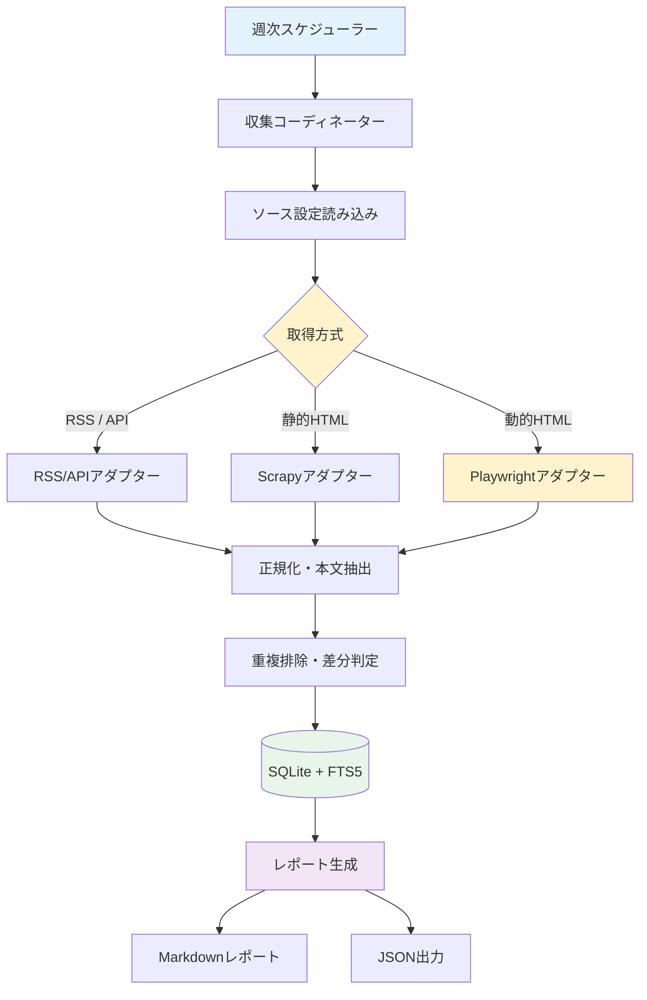

# AI Scraper (news_crawler)

AI最新トレンド・技術動向を定期的に自動収集・翻訳・要約・レポート化するスクレイピングシステムです。

---

## 概要

国内外の主要AI情報ソース（公式ブログ、テックメディア、研究機関、ニュースレター）から新着記事を自動収集し、SQLite（FTS5対応）に構造化して保存、週次Markdownレポートを生成します。AIによる日本語翻訳・要約機能も搭載しています。

### 主な特徴

- **ハイブリッド取得**: RSS/API、Hugging Face Hub API、Scrapy（静的HTML）、Playwright（動的JSレンダリング）の最適な方式をソースごとに選択。
- **AI翻訳・要約**: AIA Proxy経由で英文記事を日本語に翻訳・要約し、オフラインで検索・レポート生成が可能。
- **差分クロール・重複排除**: 正規化URLおよびコンテンツハッシュによる未取得記事の差分収集。
- **SQLite + FTS5 全文検索**: 英文・日本語の両方で高速なローカル全文検索。
- **柔軟な設定管理**: `config/sources.yaml` で対象ソース・セレクター・取得頻度を一元管理。
- **週次Markdownレポート出力**: カテゴリ別・ソース別の新着記事サマリーを自動生成。

---

## システムアーキテクチャ



---

## 必要要件

- **Python**: 3.13 以上
- **パッケージマネージャ**: `uv`
- **実行環境**: Linux / WSL2 (Ubuntu 22.04+)
- **Node.js**: 20 以上（ドキュメントLint用）

---

## セットアップ

### 1. リポジトリのクローンと依存関係インストール

```bash
cd ~/dev/news_crawler

# Python 依存関係の同期
uv sync

# Playwright ブラウザのインストール（初回のみ）
# 社内プロキシ環境ではSSL証明書エラーを回避するため環境変数を設定
NODE_TLS_REJECT_UNAUTHORIZED=0 uv run playwright install chromium
```

### 2. 設定ファイルの準備

```bash
# サンプル設定から本番設定を作成
cp config/sources.example.yaml config/sources.yaml
```

---

## 使い方

### クロールの実行

```bash
# 全ソースのクロール実行
uv run news-crawler crawl

# 特定ソースのみクロール
uv run news-crawler crawl --source openai

# dry-run（DB保存なしで取得確認）
uv run news-crawler crawl --dry-run
```

### 現在のソース一覧（18有効 + 12無効 = 30サイト）

| カテゴリ | ソース数 | ソース名 |
| --- | --- | --- |
| official | 5 | OpenAI News, Google DeepMind Blog, Hugging Face Blog, Meta Llama, Mistral AI |
| media | 5 | TechCrunch AI, MIT Technology Review (AI), AI News, Ars Technica (AI), MarkTechPost |
| domestic | 3 | Ledge.ai (Playwright), AINOW, AIsmiley |
| chinese_official | 3 | DeepSeek (Hugging Face), Qwen (Hugging Face), Qwen Blog |
| newsletter | 2 | Import AI (Jack Clark), Last Week in AI |

### 無効ソース（アクセス不可またはRSSフィードなし）

以下のサイトはアクセス制限、RSSフィードの不在、またはSSL証明書エラーにより無効化されています。詳細は <ref_file file="/home/asain/dev/news_crawler/Idea_memo.md" /> を参照してください。

- VentureBeat (AI)
- Wired (AI)
- The Verge (AI)
- ITmedia AI+
- AI Market
- AI総研
- ZDNET Japan (AI)
- The Rundown AI
- The Batch (DeepLearning.AI)
- TLDR AI
- Anthropic (Hugging Face)
- THUDM (Hugging Face)

---

### Hugging Faceからのモデル情報取得

`fetch_method: "huggingface"` を指定すると、Hugging Face Hubの公開APIから対象アカウントの最新20モデルを取得します。現在はDeepSeekとQwenを対象にしています。

取得項目はモデルID、作成日時、パイプライン、ライブラリー、タグ、いいね数、ダウンロード数です。これらはHugging Face上の公開モデル情報であり、企業公式サイトのニュースリリースそのものではありません。

```yaml
sources:
  deepseek_hf:
    name: "DeepSeek (Hugging Face)"
    category: "chinese_official"
    fetch_method: "huggingface"
    enabled: true
    base_url: "https://huggingface.co/deepseek-ai"
```

```bash
uv run news-crawler crawl --source deepseek_hf
uv run news-crawler crawl --source qwen_hf
```

### AI翻訳・要約（オプション）

AIA Proxyを利用して、収集した英文記事を日本語に翻訳・要約できます。

```bash
# AI翻訳・要約を有効化（config/crawler.yamlでai.enabled: true）
uv run news-crawler enrich --days 7 --limit 50

# 失敗した記事を再試行
uv run news-crawler enrich --days 7 --retry-failed
```

AI処理には以下の特徴があります。

- **原文保存後の処理**: まず原文を確実にDBに保存し、その後にAI処理を行うため、AI障害でも原文は保持されます。
- **差分処理**: 新規記事・内容変更記事のみを処理し、不変記事は再処理しません。
- **システムプロンプトのカスタマイズ**: `config/crawler.yaml` の `ai.system_prompt` で出力形式や要約方針を調整できます。
- **再処理の明示制御**: プロンプトを変更して処理済み記事を再適用したい場合は、`config/crawler.yaml` の `ai.prompt_version` を更新（例: `"1"` → `"2"`）します。
- **オフライン検索**: 日本語タイトル・要約はDBに保存されるため、オフラインで日本語検索が可能です。
- **レート制限対応**: リクエスト間隔を設定し、APIレート制限を回避します。

### レポートの生成

収集した記事からMarkdownレポートを生成します。既定でワードクラウドと単語頻度分布（パイチャート）の可視化が有効です。

```bash
# 直近7日間の週次レポートを生成（可視化あり）
uv run news-crawler report

# 期間指定（例: 直近30日間、Top 15単語）
uv run news-crawler report --days 30 --top-n 15

# 日付範囲指定
uv run news-crawler report --start-date 2026-09-01 --end-date 2026-09-14

# 定義済み期間（week/month/quarter）
uv run news-crawler report --period month

# 可視化なしでテキストのみのレポートを生成
uv run news-crawler report --no-visualize
```

レポートの可視化には以下の特徴があります。

- **言語別分析**: 日本語（SudachiPyによる形態素解析）と原文（英数字トークナイズ）を個別に分析します。
- **アセット出力**: 画像はレポートファイル名に基づいたアセットディレクトリ（例: `report_assets/`）に出力され、Markdownから相対パスで参照されます。
- **Frontmatterの拡充**: 分析条件（期間、Top N、可視化有無等）がレポートのFrontmatterにYAML形式で記録されます。
- **日本語フォント**: 既定でシステム内の一般的な日本語フォントを自動検出します。明示的に指定する場合は `config/crawler.yaml` の `report.japanese_font_path` を設定してください。

### 記事の検索 (FTS5 全文検索)

```bash
# キーワード検索（英文・日本語両対応）
uv run news-crawler search "Claude 3.7"
uv run news-crawler search "AIモデル"

# カテゴリ絞り込み検索
uv run news-crawler search "Agent" --category official
```

### ソース一覧の確認

```bash
uv run news-crawler list-sources
```

---

## ドキュメント・コードの検証 (Lint & Test)

```bash
# Markdown / 日本語 Textlint の実行
npm run lint

# Python 静的解析 (Ruff)
uv run ruff check .

# Python 型チェック (Mypy)
uv run mypy src

# テスト実行 (Pytest)
uv run pytest

# Hugging Faceアダプターと設定読み込みの対象テスト
uv run pytest tests/test_adapters.py tests/test_config.py
```

### テスト設計

- 外部APIへの実通信は単体テストで行わず、`respx` でHugging Face APIの応答を固定して再現性を確保します。
- アダプターテストではAPI URL、モデルID、URL、作成日時、統計値、タグ、`content_hash`への変換を検証します。
- `modelId` がない不正な項目を無視し、他の正常なモデルを保持することも検証します。
- 設定テストでは `fetch_method: "huggingface"` が `FetchMethod.HUGGINGFACE` として読み込まれることを検証します。
- 実サイトへの疎通確認は単体テストから分離し、`crawl --source <key> --dry-run` で手動実行します。

---

## ディレクトリ構成

```text
news_crawler/
├── pyproject.toml              # Python プロジェクト定義 (uv)
├── uv.lock                     # 依存バージョン固定ロックファイル
├── package.json                # npm スクリプト・Lint 定義
├── .markdownlint.json          # Markdown lint 設定
├── .textlintrc.json            # 日本語 textlint 設定
├── .gitlab-ci.yml              # GitLab CI パイプライン
├── LICENSE                     # MIT License
├── README.md                   # 本ドキュメント
├── AGENTS.md                   # エージェント用リファレンス
├── Idea_memo.md                # 設計書および候補ソース一覧
├── config/
│   ├── sources.example.yaml    # ソース設定テンプレート
│   ├── sources.yaml            # 実運用ソース設定 (gitignore対象可)
│   └── crawler.yaml            # クローラー共通設定 (レート制限等)
├── src/
│   └── news_crawler/
│       ├── __init__.py
│       ├── ai_processor.py     # AI翻訳・要約プロセッサー
│       ├── cli.py              # CLI エントリポイント
│       ├── config.py           # YAML 設定ローダー
│       ├── models.py           # Pydantic データモデル
│       ├── database.py         # SQLite + FTS5 リポジトリ
│       ├── normalizer.py       # URL・テキスト正規化
│       ├── coordinator.py      # クロール実行コーディネーター
│       ├── reporting.py        # Markdown レポート生成
│       └── adapters/           # 取得アダプター群
│           ├── __init__.py
│           ├── rss.py          # RSS / Atom アダプター
│           ├── huggingface.py  # Hugging Face Hub API アダプター
│           ├── github.py       # GitHub Releases API アダプター
│           ├── html.py         # 静的 HTML (Scrapy) アダプター
│           └── playwright.py   # 動的 HTML (Playwright) アダプター
├── tests/                      # テストコード
│   ├── fixtures/               # テスト用フィクスチャ (HTML/XML)
│   ├── conftest.py
│   ├── test_adapters.py
│   ├── test_ai_processor.py
│   ├── test_cli.py
│   ├── test_config.py
│   ├── test_database.py
│   ├── test_normalizer.py
│   └── test_reporting.py
├── data/                       # SQLite DB 保存先 (gitignore)
└── output/                     # レポート出力先 (gitignore)
```

---

## ライセンス

[MIT License](LICENSE) © 2026 asain
